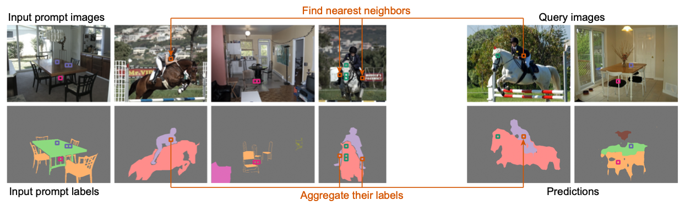
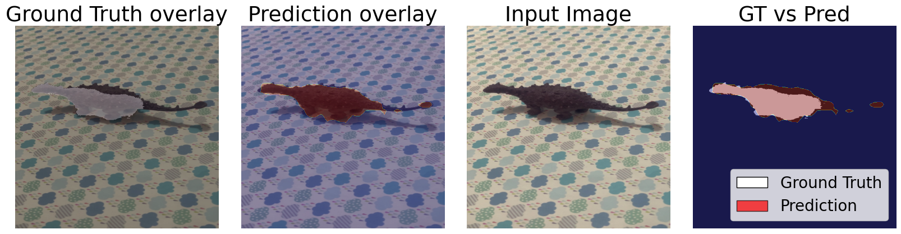
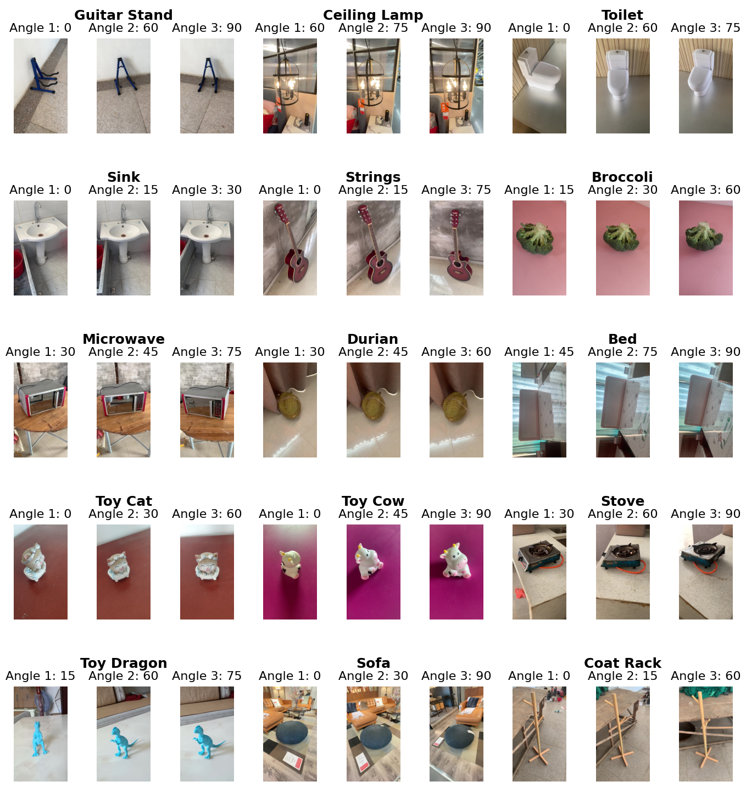

# Open Hummingbird Evaluation

This repository contains code for evaluating vision encoders using the Hummingbird Evaluation method. The project provides tools to assess the performance of various vision models on segmentation tasks, particularly focusing on the Multi-View ImageNet (MVImgNet) dataset.


*Hummingbird Evaluation method diagram from ["Towards In-context Scene Understanding", NeurIPS 2023](https://arxiv.org/abs/2306.01667)*

## Features

- Support for multiple vision encoders (DINO, CLIP, etc.)
- GPU-accelerated evaluation using FAISS
- Support for Multi-View ImageNet dataset with camera extrinsics
- Flexible memory bank configuration
- Comprehensive evaluation metrics including mIoU


*Example of ground truth vs. predictions using DINO model*

## Repository Structure

```
.
├── colmap/              # COLMAP installation and configuration
├── datasets/           # Dataset storage directory
├── examples/           # Example notebooks and scripts
├── file_sets/         # Dataset file lists and splits
├── hbird/             # Core evaluation code
├── images/            # Project images and figures
├── jobs/              # SLURM job scripts for experiments
├── logs/              # Experiment logs
├── old_code/          # Legacy code
├── python_scripts/    # Python utility scripts
├── results/           # Experiment results
├── eval.py           # Main evaluation script
├── environment.yml    # Conda environment specification
└── requirements.txt   # Python package requirements
```

## Installation

1. Clone the repository:
```bash
git clone https://github.com/vpariza/open-hummingbird-eval.git
cd open-hummingbird-eval
```

2. Install COLMAP:
```bash
# Download and install from https://github.com/colmap/colmap
```

3. Install the required dependencies:
```bash
pip install torch==2.2.2 torchvision==0.17.2 torchaudio==2.2.2 --index-url https://download.pytorch.org/whl/cu121
pip install lightning==2.4.0
pip install torchmetrics==1.7.0
pip install tqdm==4.67.1
pip install scipy==1.15.2
pip install joblib==1.4.2
pip install numpy==1.26.4
pip install triton==2.2.0
pip install faiss-gpu-cu12
```

## Usage

### Basic Evaluation

The main evaluation script can be run using:

```bash
python eval.py \
    --model <model_name> \
    --embeddings-size <size> \
    --batch-size <batch_size> \
    --input-size <input_size> \
    --patch-size <patch_size> \
    --data-dir <path_to_dataset>
```

### Example Jobs

The repository includes several example job scripts in the `jobs/` directory:

- `test_mvimgnet.job`: Evaluation on Multi-View ImageNet dataset
- `test_exp_a_b.job`: Experiment A and B testing

### Environment Setup

The repository includes scripts to set up different environments:

- `create_hbird_env.job`: Main environment setup
- `create_mvimgnet_env.job`: Environment for Multi-View ImageNet experiments
- `create_tips_env.job`: Environment for TIPS experiments

## Changes hbird folder
- `hbird_eval.py` : Changes in functions `hbird_evaluation` and `evaluate`
- `eval_metrics.py` : Changes in function `comptute`
- `mvimgnet_data.py` : Added a new dataloader

## Python scripts folder
- `exp_a_b.py` : Is used for calculating all results
- `table_reproduction.py` : Used to recreate the table

## Examples folder

The `examples/` directory contains several Jupyter notebooks demonstrating different use cases:

- `hbird_eval_example_faiss_gpu.ipynb`: Basic evaluation using FAISS GPU
- `hbird_eval_example_scann.ipynb`: Evaluation using SCANN
- `hbird_eval_multiview_analysis*.ipynb`: Analysis of multi-view performance with different memory sizes
- `mvimgnet_create_bins.ipynb` : Sorting MVImgNet to a new dataset folder named `split_angles_mvimagenet`
- `mvimgnet_masks_vs_preds.ipynb` : Visualization of Dino prediction masks


*Example of multi-view analysis on MVImgNet dataset*

## Dataset

The project uses the Multi-View ImageNet (MVImgNet) dataset. The dataset includes:
- Multi-view images with camera extrinsics
- Segmentation masks
- Camera parameters (obtained using COLMAP)

### Dataset Download

The MVImgNet dataset can be downloaded from:
- [MVImgNet Dataset](https://1drv.ms/u/s!AnBBK4_o1T9MbXrxhV7BpGdS8tk?e=P7G6F0)

After downloading, you'll need to:
1. Extract the dataset to the `datasets/` directory
2. Run COLMAP to obtain camera extrinsics
3. Organize the data according to the structure in `file_sets/`

## Contributing

| n  | Name |
| ------------- | ------------- |
| 1  |  Brandon Li |
| 2  |  Emma Boccaletti |
| 3  |  Julian Bibo |
| 4  | Lívia Baxová  |
| 5  |  Toyesh Chakravorty |
| 6  |  Valentina Lilova |

Feel free to submit issues and enhancement requests!

## License

[Add your license information here] 
