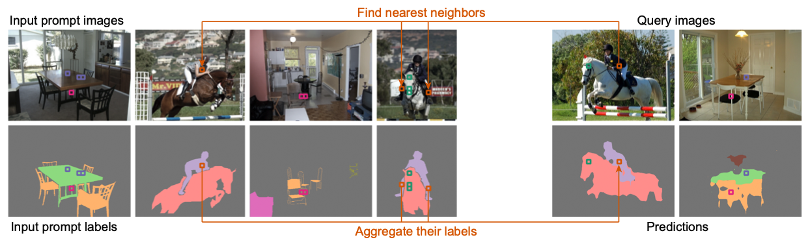

# 🐦 Open Hummingbird Evaluation — Next Generation

[](./LICENSE)


> 🆕 **This is the 2.0.0 release of Open Hummingbird Evaluation.**  
> For the legacy implementation (1.x branch), visit:  
> 👉 [open-hummingbird-eval/v1.x](https://github.com/vpariza/open-hummingbird-eval/tree/v1.x)

> **Patch-level semantic evaluation and feature transfer for Vision Transformers — simplified, accelerated, and refactored.**

---

## 🚀 Overview

**Open Hummingbird Evaluation** is a research toolkit to measure *semantic coherence* of patch-level features in **Vision Transformers (ViTs)**.

It builds a **memory bank** of training patch embeddings and performs **nearest-neighbor retrieval** on validation patches to evaluate how well the learned features align with semantic classes.  
The evaluation uses **soft label transfer** and computes **mean Intersection over Union (mIoU)** using a differentiable clustering metric.

This updated version introduces:

- 🗜️ **Tar-based dataset loaders** — read images directly from `.tar` files without extraction  
- ⚡ **Faiss-GPU** and **ScaNN** nearest-neighbor backends  
- 🔩 **Plug-and-play ViT extractors** for DINO, MAE, MoCo-v3, and custom backbones  
- 🧰 **Unified utilities** for transforms, I/O, and metrics  
- 🔁 **PyTorch Lightning datamodules** for consistent pipelines  
- 📦 **Container-ready builds** for CPU and GPU environments  

<p align="center">
  
</p>

---

## 🧩 Repository Structure

```
open-hummingbird-eval-updated/
│
├── eval.py                        # CLI entry point for evaluation
├── examples/                      # Example Jupyter notebooks
├── file_sets/                     # Predefined dataset subsets
├── hbird/                         # Core library
│   ├── hbird_eval.py              # Main evaluation engine
│   ├── models.py                  # Feature extractors
│   ├── utils/                     # I/O, metrics, transforms
│   ├── data/                      # Dataset loaders (folder + tar)
│   └── nn/                        # NN backends (Faiss, ScaNN)
├── singularity_defs/              # Container definitions
├── INSTALLATION.md                # Installation instructions
├── DATASET.md                     # Dataset preparation guide
├── CITATION.cff                   # Citation information
└── LICENSE                        # License
```

---

## 💾 Installation

See [**INSTALLATION.md**](./INSTALLATION.md) for detailed setup instructions.

Quick install:
```bash
git clone https://github.com/vpariza/open-hummingbird-eval-updated.git
# Necessary Libraries
pip install torch==2.7.1 torchvision==0.22.1 torchaudio==2.7.1 --extra-index-url https://download.pytorch.org/whl/cu126
conda install -c pytorch -c rapidsai -c rapidsai-nightly -c conda-forge -c nvidia pytorch/label/nightly::faiss-gpu-cuvs "cuda-version>=12.6,<12.7" "numpy>=2.0,<2.3" "scipy>=1.14,<1.16"
pip install lightning==2.5.5
pip install tqdm==4.67.1
# Make the repository available as a library
cd open-hummingbird-eval-updated
pip install -e .
```

Containerized build (reproducible environment):
```bash
singularity build hbird.sif singularity_defs/hbird_cuda12_1.def
```

---

## 📦 Dataset Preparation

Supported datasets:
- **ADE20K**
- **Cityscapes**
- **Pascal VOC**
- **COCO**
- **MVImgNet** (3D / multi-view evaluation over viewpoint angle bins)

Datasets can be stored either as folders or tar archives.

See [**DATASET.md**](./DATASET.md) for full dataset layouts, subset usage (`file_sets/`), and tar syntax.

Example:
```
/datasets/ade20k/
  ├── images/training/
  └── annotations/training/
```
or, tar-based:
```
/datasets/ade20k.tar!/images/training/
```

---

## 🧠 Quick Start

### ▶ 1. Command-line evaluation

```bash
python eval.py \
  --dataset-name voc \
  --data-dir /your/path/to/pascal/voc \
  --d-model 768 --input-size 518 \
  --batch-size 16 --device cuda --amp \
  --dinov2 vitb14 \
  --nn-method faiss
```

### ▶ 2. Python API usage

#### Example on how to Evaluate dino with the Hummingbird (Dense NN Retrieval) Evaluation  on Pascal VOC

```python
import torch
from hbird.hbird_eval import hbird_evaluation
# Parameters for the model dino
device = 'cuda'
input_size = 224
batch_size = 64
patch_size = 16
embed_dim = 384
model = torch.hub.load('facebookresearch/dino:main', 'dino_vits16')

# Define the function to extract features from the model
# Input to the function is the model and the images
# Output of the function is the features extracted from the model 
# and optionally the attention maps
fn = lambda model, imgs: (model.get_intermediate_layers(imgs)[0][:, 1:], None)


# Evaluate the model using the Full In-Context Learning Hummingbird  
# or Dense k-NN Retrieval Evaluation on the Pascal VOC Dataset
hbird_miou = hbird_evaluation(model.to(device), 
        d_model=embed_dim,          # size of the embedding feature vectors of patches
        patch_size=patch_size, 
        batch_size = batch_size, 
        input_size=input_size,             
        augmentation_epoch=1,       # how many iterations of augmentations to use on top of 
                                    # the training dataset in order to generate the memory
        device=device,              
        return_knn_details=False,   # whether to return additional NNs details
        n_neighbours=30,            # the number of neighbors to fetch per image patch
        nn_method='faiss',          # options: faiss or scann as the k-nn library to be used, scann uses cpu, faiss gpu
        nn_params=None,             # Other parameters to be used for the k-NN operator
        ftr_extr_fn=fn,             # function that extracts image patch features with 
                                    # a vision encoder
        dataset_name='voc',         # the name of the dataset to use, 
                                    # currently only Pascal VOC is included.
        data_dir='<the path to the Pascal VOC Dataset>',    # path to the dataset 
                                                            # to use for evaluation
        memory_size=None,           # How much you want to limit your datasetNone if to be left unbounded
        train_fs_path=None,         # The path to the file with the subset of filenames for training
        val_fs_path=None,           # The path to the file with the subset of filenames for validation
    )           
                                    
print('Dense NN Ret - miou score:', hbird_miou) 

```

#### Example on how to Evaluate dinov2 with Dense NN Retrieval on Pascal VOC

```python
import torch
from hbird.hbird_eval import hbird_evaluation
# Parameters for the model dino
device = 'cuda'
input_size = 224
batch_size = 256
patch_size = 14
embed_dim = 384
model = torch.hub.load('facebookresearch/dinov2', 'dinov2_vits14')

# Define the function to extract features from the model
# Input to the function is the model and the images
# Output of the function is the features extracted from the model 
# and optionally the attention maps
fn = lambda model, imgs: (model.forward_features(imgs)['x_norm_patchtokens'], None)


# Evaluate the model using the Full In-Context Learning Hummingbird  
# or Dense k-NN Retrieval Evaluation on the Pascal VOC Dataset
hbird_miou = hbird_evaluation(model.to(device), 
        d_model=embed_dim,          # size of the embedding feature vectors of patches
        patch_size=patch_size, 
        batch_size = batch_size, 
        input_size=input_size,             
        augmentation_epoch=1,       # how many iterations of augmentations to use on top of 
                                    # the training dataset in order to generate the memory
        device=device,              
        return_knn_details=False,   # whether to return additional NNs details
        n_neighbours=30,            # the number of neighbors to fetch per image patch
        nn_method='faiss',          # options: faiss or scann as the k-nn library to be used, scann uses cpu, faiss gpu
        nn_params=None,             # Other parameters to be used for the k-NN operator
        ftr_extr_fn=fn,             # function that extracts image patch features with 
                                    # a vision encoder
        dataset_name='voc',         # the name of the dataset to use, 
                                    # currently only Pascal VOC is included.
        data_dir='<the path to the Pascal VOC Dataset>',    # path to the dataset 
                                                            # to use for evaluation
        memory_size=None,           # How much you want to limit your datasetNone if to be left unbounded
        train_fs_path=None,         # The path to the file with the subset of filenames for training
        val_fs_path=None,           # The path to the file with the subset of filenames for validation
    )   
print('Dense NN Ret - miou score:', hbird_miou) 

```

### ▶ 3. Interactive notebooks

See [**examples/**](./examples):
- `hbird_eval_example_faiss_gpu.ipynb`
- `hbird_eval_example_scann.ipynb`
- `hbird_3d_eval_example_new.ipynb` — 3D (multi-view) evaluation on MVImgNet
- `mvimgnet_create_bins_new.ipynb` — split MVImgNet captures into viewpoint angle bins
- `hbird_eval_multiview_analysis_memory.ipynb` — plots and tables from the 3D evaluation results

---

### ▶ 4. 3D (multi-view) evaluation on MVImgNet

Evaluates how well dense features generalize across viewpoint changes: the patch
memory is built from selected viewpoint (angle) bins and each validation bin is
evaluated separately, yielding per-class IoU as a function of viewpoint change.

```bash
python eval.py \
  --dataset-name mvimgnet \
  --data-dir /your/path/to/mvimgnet_bins \
  --model-repo facebookresearch/dinov2:main --model-name dinov2_vits14 \
  --d-model 384 --patch-size 14 --input-size 504 \
  --batch-size 64 --device cuda \
  --nn-method faiss \
  --train-bins 0,30,60,90 \
  --val-bins 0,15,30,45,60,75,90
```

The expected data layout (`<class_id>/<angle_bin>/{img,mask}/`) is documented in
[**DATASET.md**](./DATASET.md) and can be produced from raw MVImgNet captures with
`examples/mvimgnet_create_bins_new.ipynb`.

---

## 🧩 Core Components

| Module | Purpose |
|--------|----------|
| **`hbird/hbird_eval.py`** | Central engine for feature extraction, memory creation, NN retrieval, label transfer, and metric computation |
| **`hbird/models.py`** | Feature extractor wrappers for Vision Transformers (e.g., DINO, MAE) |
| **`hbird/utils/eval_metrics.py`** | `PredsmIoU` implementation for semantic matching and soft IoU |
| **`hbird/utils/image_transformations.py`** | Paired image–mask augmentations (resize, crop, jitter) |
| **`hbird/utils/transforms.py`** | High-level transform pipelines for train/val |
| **`hbird/utils/io.py`** | I/O helpers supporting both filesystem and `.tar` archives |
| **`hbird/data/*`** | Dataset modules for ADE20K, Cityscapes, VOC, and COCO (folder + tar) |
| **`hbird/nn/*`** | Nearest neighbor backends: Faiss-GPU and ScaNN |

---

## ⚙️ Typical Workflow

1. **Select your model** (e.g., DINO-ViT-B/16 from TIMM)  
2. **Load your dataset** using `Ade20kDataModule`, `VOCDataModule`, etc.  
3. **Run evaluation** with `eval.py` or the Python API  
4. **Visualize metrics**: IoU, clustering maps, label transfer quality  

---

## ⚡ Highlights

- 🔥 **Tar-streamed loading** — read directly from archives  
- ⚙️ **Pluggable backends** — switch between Faiss and ScaNN seamlessly  
- 🧮 **Distributed-aware** — sync features across ranks cleanly  
- 🧠 **Patch-level metrics** — quantify semantic alignment precisely  
- 📊 **Flexible subsets** — use curated splits from `file_sets/`

---

## 📊 Example Results

### Results we got with our implementation on Pascal VOC
For the experiments below we used the `scann` library two dataset augmentation epochs and
also we used image size of (512,512) for the dino and (504,504) for dinov2.

<table>
  <tr>
    <th rowspan="2">arch</th>
    <th rowspan="2">model</th>
    <th colspan="3">PVOC (mIoU) per Memory Size</th>
    <th colspan="1">PVOC (mIoU) <br> from orig. Paper</th>
  </tr>
  <tr>
    <th>1024*10<sup>2</sup></th>
    <th>1024*10<sup>3</sup></th>
    <th>1024*10<sup>4</sup></th>
    <th>1024*10<sup>4</sup></th>
  <tr>
    <td>ViT-S/16</td>
    <td>dino</td>
    <td>37.2</td>
    <td>43.1</td>
    <td>46.6</td>
    <td>-</td>
  </tr>
  <tr>
    <td>ViT-B/16</td>
    <td>dino</td>
    <td>44.9</td>
    <td>50.8</td>
    <td>55.7</td>
    <td>55.9</td>
  </tr>
  <tr>
    <td>ViT-S/14</td>
    <td>dinov2</td>
    <td>70.2</td>
    <td>74.9</td>
    <td>77.0</td>
    <td>-</td>
  </tr>
  <tr>
    <td>ViT-B/14</td>
    <td>dinov2</td>
    <td>69.1</td>
    <td>74.6</td>
    <td>76.9</td>
    <td>-</td>
  </tr>
  <tr>
    <td>ViT-L/14</td>
    <td>dinov2</td>
    <td>64.6</td>
    <td>71.7</td>
    <td>74.8</td>
    <td>-</td>
  </tr>
  <tr>
    <td>ViT-G/14</td>
    <td>dinov2</td>
    <td>62.3</td>
    <td>69.9</td>
    <td>73.6</td>
    <td>-</td>
  </tr>
</table>

---

## 📚 Learn More

- [**INSTALLATION.md**](./INSTALLATION.md) — full environment setup  
- [**DATASET.md**](./DATASET.md) — dataset format and subset guides  
- [**examples/**](./examples) — Jupyter demos  
- [**hbird/**](./hbird) — core source code  

---

## Contributors

| n  | Username |
| ------------- | ------------- |
| 1  | [@vpariza](https://github.com/vpariza)  |
| 2  | [@Smsd75](https://github.com/Smsd75) |
| 3  | [@yukimasano](https://github.com/yukimasano) |

## 🧑‍💻 Citation

If you use this repository in your research, please cite:

```bibtex
@misc{pariza2024hbird,
      author = {Pariza, Valentinos and Salehi, Mohammadreza and Asano, Yuki},
      month = {4},
      title = {Hummingbird Evaluation for vision encoders},
      url = {https://github.com/vpariza/open-hummingbird-eval},
      year = {2024}
}
```

---

## 🪶 License

Distributed under the **MIT License** — see [LICENSE](./LICENSE).

---

## ✨ Acknowledgements

Originally inspired by [Hummingbird Evaluation from the work of "Towards In-context Scene Understanding" of Balazevic et al.](https://openreview.net/forum?id=FasIQqsJhe). 

```
@inproceedings{
      balazevic2023towards,
      title={Towards In-context Scene Understanding},
      author={Ivana Balazevic and David Steiner and Nikhil Parthasarathy and Relja Arandjelovic and Olivier J Henaff},
      booktitle={Thirty-seventh Conference on Neural Information Processing Systems},
      year={2023},
      url={https://openreview.net/forum?id=FasIQqsJhe}
}
```

---
